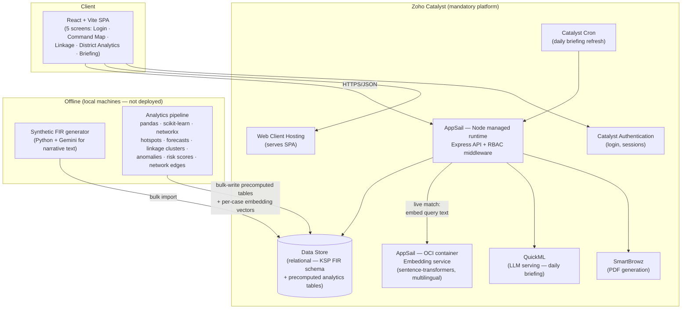
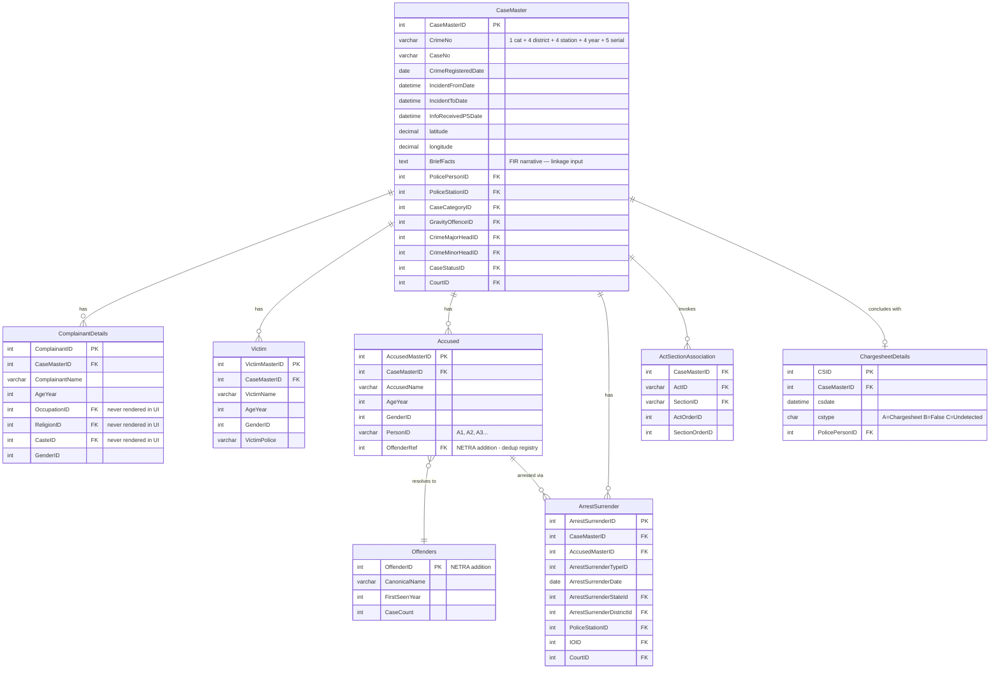
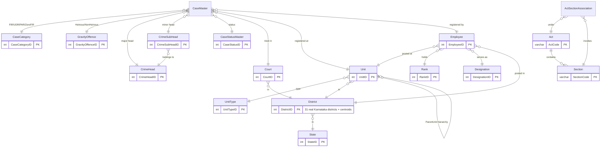

# NETRA — System Design

**Networked Evidence, Tracking & Risk Analytics** · KSP Datathon 2026 · Challenge 2

> One-line architecture: React SPA on Catalyst Web Client Hosting → Express API on Catalyst AppSail → Catalyst Data Store (relational, mirroring KSP's FIR schema), with an offline Python pipeline that precomputes all AI results and a self-hosted embedding service powering live case-linkage matching.

---

## 1. Architecture Overview



**Key decisions**

| Decision | Rationale |
|---|---|
| Python analytics runs **offline batch**, not as a service | No second live deployment to babysit; results always ready; demo can't be killed by a slow model |
| **One embedding space** — the same sentence-transformer model embeds both the corpus (offline) and live queries (AppSail container) | Cosine similarity across different embedding models is meaningless; this was caught in design review |
| **TF-IDF fallback** implemented in pure JS inside Express | Live match works even if the embedding container is down; also the v1 floor the embeddings must beat |
| Data Store (relational) over NoSQL | KSP's ER diagram **is** relational — our tables mirror it 1:1, which is a credibility feature, and Catalyst rules discourage third-party alternatives |
| Embeddings loaded into AppSail memory at boot | Cosine over ≤50k × 384-dim vectors is a few ms in-process; no vector DB needed |

---

## 2. Component Responsibilities

### 2.1 React SPA (Web Client Hosting)
- **Login** — Catalyst Authentication; role decides landing scope
- **Command Map** — Leaflet + OpenStreetMap; Karnataka district choropleth → station drilldown; layers: incidents, DBSCAN hotspots, 7-day forecast heatmap, patrol suggestions; alert feed; data-quality panel (% FIRs missing coordinates)
- **Linkage** — serial-crime cluster list & detail (member FIRs, shared-MO summary, confidence); **live match box**: paste FIR text → top-k similar cases + cluster match with similarity scores
- **District Analytics** — tabs: Trends (time series + anomaly markers) · Outcomes (chargesheet A / false B / undetected C rates per unit) · Offender Network (force-directed graph of co-accused links)
- **Briefing** — daily AI brief (EN/KN), rendered + PDF download

### 2.2 Express API (AppSail managed runtime)
- Reused from boilerplate: app structure, error handler, request logging, RBAC middleware pattern
- Auth: validates Catalyst Authentication session; maps user → role + jurisdiction
- Serves: case queries with filters, aggregations, all precomputed analytics tables, live match route
- Live match flow: `POST /api/linkage/match` → embed query via embedding service (same model as corpus; TF-IDF fallback) → in-memory cosine against `CaseEmbeddings` → return top-k cases + best cluster

### 2.3 Embedding service (AppSail OCI container)
- `paraphrase-multilingual-MiniLM-L12-v2` (or equivalent multilingual model — must handle Kannada script)
- Single endpoint: `POST /embed { text } → { vector[384] }`
- Same model binary used offline to embed the corpus — **never mix models**

### 2.4 Offline pipeline (local, Python)
1. **Generator**: ~50k FIRs (2021–2026) on KSP schema; Bengaluru-weighted geography; seasonal patterns; planted: hotspot clusters, repeat offenders, serial-MO patterns (defined as semantic attributes — entry method, tool, target, time window); Gemini writes varied `BriefFacts` narratives (~20% in Kannada script); blind-test patterns injected separately by Backend lead
2. **Analytics**: DBSCAN hotspots · grid-cell gradient-boosting forecast · seasonal-decomposition anomaly detection · TF-IDF/embedding clustering for linkage · networkx co-accused graph · explainable risk scores (top-3 reasons each)
3. **Load**: bulk-write all precomputed tables + per-case vectors to Data Store (tiered import to respect quotas; 10k cases minimum viable)

---

## 3. ER Diagram

### 3.1 Core FIR schema (mirrors KSP's official ER document)

Field names are verbatim from the KSP "Police FIR System — ER Diagram" design document.



### 3.2 Classification & organisation lookups (KSP schema)



### 3.3 NETRA precomputed analytics tables (written by the offline pipeline)

```mermaid
erDiagram
    Hotspots {
        int HotspotID PK
        int DistrictID FK
        int CrimeHeadID FK
        decimal centroidLat
        decimal centroidLng
        decimal radiusMeters
        int caseCount
        varchar timeWindow
        json memberCaseIDs
    }

    Forecasts {
        int ForecastID PK
        varchar gridCellID "geohash cell"
        int DistrictID FK
        int CrimeHeadID FK
        date forecastDate
        decimal riskScore
        json topReasons "top-3 plain-language reasons"
        json patrolSuggestion "suggested window + route anchor"
    }

    LinkedCaseClusters {
        int ClusterID PK
        varchar label "e.g. Serial Cluster 3"
        json memberCaseIDs "cross-district FIRs"
        json districtsSpanned
        text sharedMOSummary
        decimal confidence
        varchar method "tfidf | embedding"
    }

    CaseEmbeddings {
        int CaseMasterID PK
        blob vector "384-dim float, loaded to memory at boot"
        varchar modelVersion "must match live service"
    }

    TrendSeries {
        int SeriesID PK
        int DistrictID FK
        int CrimeHeadID FK
        varchar granularity "week | month"
        json points
    }

    Alerts {
        int AlertID PK
        int DistrictID FK
        int CrimeHeadID FK
        datetime detectedAt
        varchar severity
        text message "e.g. vehicle theft +40 pct in 6 weeks"
        json evidence
    }

    RiskScores {
        int ScoreID PK
        int UnitID FK
        decimal score
        json topReasons "explainability - top-3 reasons"
        date computedFor
    }

    NetworkEdges {
        int EdgeID PK
        int OffenderA FK
        int OffenderB FK
        int sharedCaseCount
        json sharedCaseIDs
    }

    Briefings {
        int BriefingID PK
        int DistrictID FK
        date briefingDate
        varchar language "en | kn"
        text content
        varchar pdfUrl "SmartBrowz output"
    }
```



---

## 4. API Contract (v1)

All routes prefixed `/api/v1`, all behind Catalyst Auth session + RBAC scoping (see §5).
Response envelope: `{ success, data, error? }`.

| Method | Route | Purpose | Notes |
|---|---|---|---|
| GET | `/cases` | Filterable case list | `?district=&station=&crimeHead=&gravity=&from=&to=&page=` |
| GET | `/cases/:id` | Full case detail | joins complainants/victims/accused/sections/chargesheet |
| GET | `/stats/summary` | KPI tiles | scoped to viewer's jurisdiction |
| GET | `/stats/trends` | Time series | from `TrendSeries`; `?district=&crimeHead=&granularity=` |
| GET | `/stats/outcomes` | A/B/C rates | per unit/district |
| GET | `/geo/districts` | Choropleth data | counts + GeoJSON refs |
| GET | `/geo/hotspots` | Hotspot layer | `?window=&crimeHead=` |
| GET | `/geo/forecast` | Forecast heatmap + patrol suggestions | `?date=&district=` |
| GET | `/alerts` | Anomaly alert feed | scoped |
| GET | `/linkage/clusters` | Serial-crime clusters | list + detail |
| POST | `/linkage/match` | **Live match** | body `{ text }`; embeds via embedding service (TF-IDF fallback), cosine in-memory, returns top-k cases + best cluster + scores |
| GET | `/network/graph` | Offender network | `?district=` nodes+edges |
| GET | `/risk/units` | Unit risk scores + reasons | scoped |
| GET | `/briefings/today` | Daily brief | `?lang=en|kn`; from cache table |
| POST | `/briefings/generate` | Regenerate brief (QuickML) | falls back to cache on failure |
| GET | `/data-quality` | Honesty panel | % missing coords, fallback level in effect |

## 5. RBAC (police hierarchy)

| Role | Maps to | Data scope |
|---|---|---|
| `hq` | DGP / SCRB HQ | all Karnataka |
| `district` | SP | own district (all its stations) |
| `station` | SHO | own station only |

Scope enforced server-side in middleware (jurisdiction claim from user record), not by the client.

## 6. Ethics & data constraints (enforced by design)

- `OccupationID`, `ReligionID`, `CasteID` exist in the schema (KSP fidelity) but are **excluded from every model's feature set and never rendered by any UI or API response**
- Models predict **places and patterns, never persons**; forecast features are place/time/crime-type only
- Every AI output carries plain-language `topReasons` (explainability) — no black-box numbers anywhere in the UI
- All outputs framed as decision support (human-in-the-loop), stated on the ethics slide

## 7. Quotas, performance, failure modes

- **Data Store free tier = ~5k insertions/month** → claim KSPH26 credits first; bulk-import in tiers; 10k cases = minimum viable demo, 50k = target
- Embedding memory: 50k × 384 × 4B ≈ 75 MB in AppSail process — fine; quantize to float16 if pressure
- Live match p95 target < 800 ms (embed ~100 ms + cosine ~10 ms + query)
- Failure ladder: embedding container down → TF-IDF fallback (flagged in response) · QuickML down → cached briefing · missing coordinates → station-level aggregation (shown in data-quality panel)

## 8. Repo layout (target)

```
NETRA/
├── app.js / server.js          # Express on AppSail (boilerplate, SaaS modules stripped)
├── routes/ controllers/ middleware/   # API v1 + RBAC scoping
├── catalyst/                   # Catalyst project config
├── embedding-service/          # Dockerfile + FastAPI /embed (AppSail OCI)
├── pipeline/                   # Python: generator/, analytics/, load/  (offline)
├── frontend/                   # React + Vite (5 screens) → Web Client Hosting
└── docs/                       # this file + KSP schema reference
```
